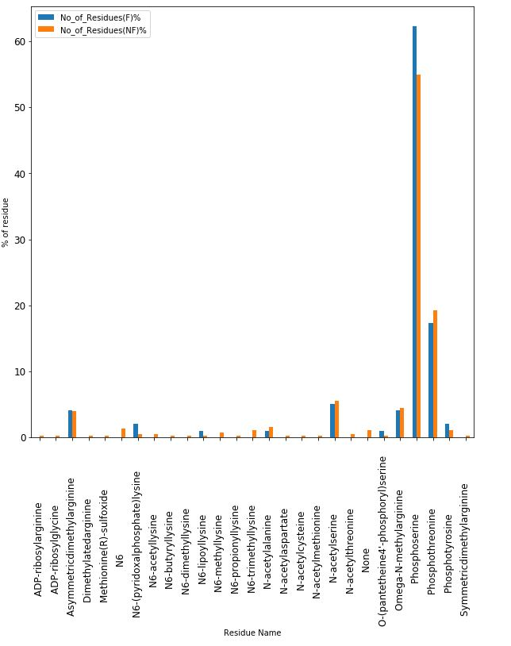

  

The Thesis which I submitted for my masters.
The aims of my thesis were to:

* Investigate the structural characteristics of peptide in relation to flyability 
* Create a predictor of flyability of peptides prior to proteomic experiments

The progression of mass spectrometry has allowed a deeper understanding of the proteome. However, the detection of every peptide in the sample remains a prevalent issue. From numerous papers it was deduced that the detectability of the peptide was linked to certain structural properties. In my dissertation the relationship between post translational modifications and peptide detectability was explored. The modified residues were mapped to peptides sequences derived from yeast and examined using statistical methods to determine if there was a relationship between peptide detectability and post translational modifications. Based on the data analysed there is no relationship between peptide detectability and post translational modifications.

  
   
 

# Tools and environment
* Python 2.7
* Numpy
* csv
* re
* Matplotlib
* json
* scipy

# Result
   

# Link to my project  
If you would like to know more about my project click on the link or you can contact me [here](contact.html)     
<a href='https://github.com/bryanm17078/MSc-Thesis/blob/master/MSc%20Dissertation.ipynb'style="color:black;"><button class="btn default">Master thesis</button></a>  

 
 
 
 
 
Copyright © Bryan Mensah

