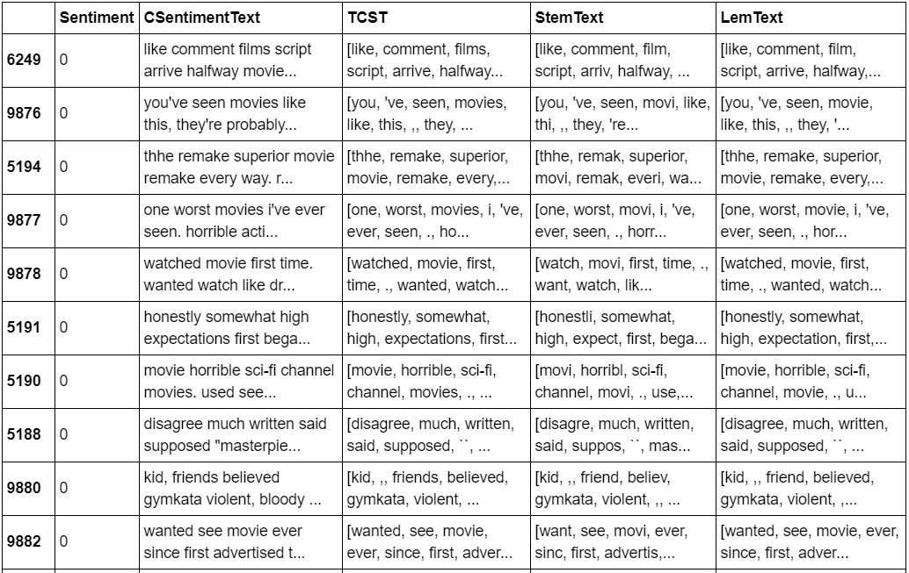

--- 
title: "Movie review Sentiment Analysis using nlp"
---

  

What is sentiment analysis?
Sentiment analysis is a type of data mining that measures the inclination of people’s opinions through natural language processing (NLP), computational linguistics and text analysis $[1]$. 

What is NLP?
Natural language processing (NLP) is a method which we try help the computer to understand, translate and process text data with little guidance on how to do so $[2]$.

With the background we can begin the sentiment analysis of the movie reviews.

# Tools and environments

* Python 2.7
* Jupyter Notebook
* Numpy
* Pandas
* Scikit-learn
* NLTK

# Dataset  
Dataset retrieved from kaggle which got the data from [here](http://ai.stanford.edu/~amaas/data/sentiment/) that list ~25000 movies review with a sentiment number corresponding to whether or not the review was good or bad (0 was bad and 1 is good).      

# Pre-processing  
Pre-processing of the data include various techniques such as:  

* punctation removal  
* tokenisation (separation of words into individual element)  
* lemmisation (reducing word to their base word)  
* stemming (reducing word to their base word- but word may not be real).    
  

# Building the model
Support vector machine is a machine learning method which is commonly used for classification. This was the reason why it was selected as we have two classes or sentiment we want to group and class.
The model was applied to the stemmed and lemmed words to see if there were any differences in the accuracy of sentiment analysis when using one method over the over.  
 
# Result of the model  
  
The accuracy of the both the stemmed and lemmed model had high accuracy (over 90%) but the lemmed text had a higher accuracy than the stemmed text.
But can it identify sentiment.

  
It can identify sentiment. Lemmed text has a higher accuracy so it could be a better technique however it may be due to the dataset.
With this analysis we can obtain people feeling on a movie and use that in future movies in order to get a more favourable review. Which is just one of its many possible application that can be applied in a real world setting.

# References  
[1] Techopedia.com. 2020. Sentiment Analysis. [online] Available at: <https://www.techopedia.com/definition/29695/sentiment-analysis> [Accessed 2 April 2020].    
[2] Techopedia.com. 2020.Natural Language Processing (NLP). [online] Available at: <https://www.techopedia.com/definition/653/natural-language-processing-nlp> [Accessed 2 April 2020].  

#  Link to project    
<a href='https://github.com/bryanm17078/NLP-Movie-Sentiment-Analysis/blob/master/NLP%20Movie%20Sentiment%20Analysis.ipynb'style="color:black;"><button class="btn default">Movie sentiment analysis </button></a>  

 
 
 
 
 
Copyright © Bryan Mensah

