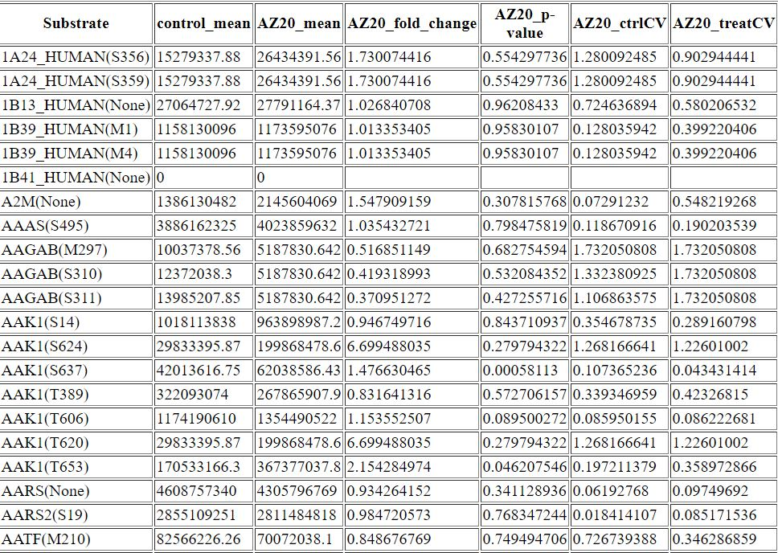
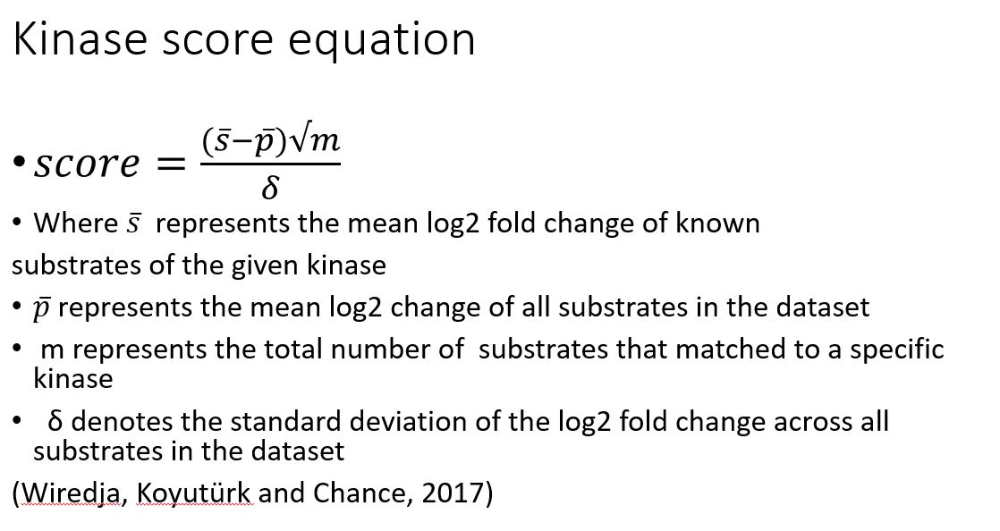
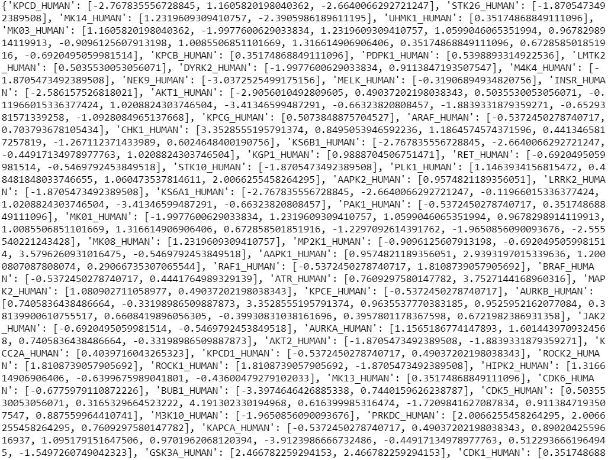

  

This was an academic group project in which we had to create a biological web application that provided information about all known human kinases (e.g. their name and gene symbol, the families they belong to, where in the cell they are typically found, and the sites they are known to phosphorylate), information about phosphosites (in terms of their genomic location, neighbouring sequence, etc.),   
information about all known inhibitors of human protein kinases(e.g. their name, chemical structure, and which kinases they are known to inhibit).And finally allow user to upload quantitative phosphoproteomics data and then summarise this data  graphically and provide an estimate of the relative activity of every human kinase in the sample represented by the data.

My role in the project was allow the user to upload their data and graphically summarize their data.  
  

# Tools and environment

* python 2.7
* numpy 
* pandas 
* matplotlib
* math
* six

From the briefing there were two Parts:  
* The graphical summary of the data
* Calculation of the relative activity

# Graphical summary

Used a variety of methods (e.g. boxplot, histogram) to try to summarise the data. Then I decided to do a volcano plot of the substrates. Since we were only interested in significant substrates. So, I extracted any significantly expressed substrates (p <0.05)
Plotted the volcano plot using the p value and log2 fold change. Then I coloured significantly upregulated substrates (P < 0.05) green and significantly downregulated substrates (P< 0.05) red.  

  

# Kinase activity

 We needed a way to calculate the relative activity using only the data we’ve been given.
From our research we found a paper which described a method to calculate the relative activity of each kinase using the fold change.

  
    
   

# Link to the project
<a href='https://github.com/bryanm17078/Group-Project/blob/master/Proteomics%20Calculations%20Final.ipynb'style="color:black;"><button class="btn default">Group project</button></a>  

 
 
 
 
 
Copyright © Bryan Mensah

