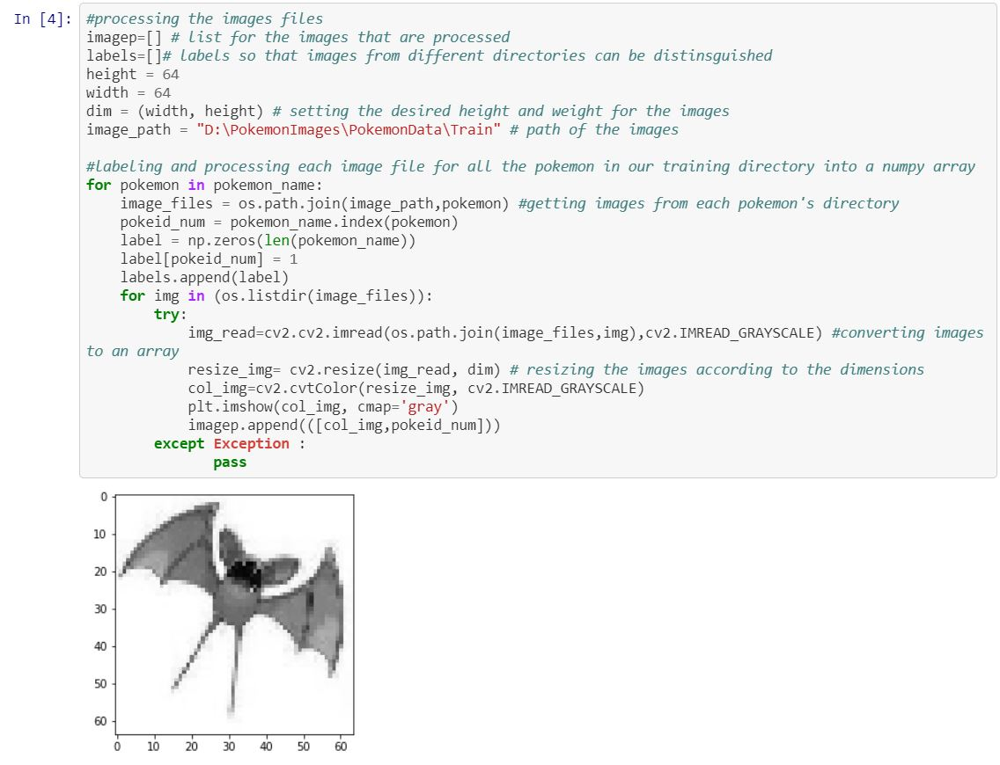
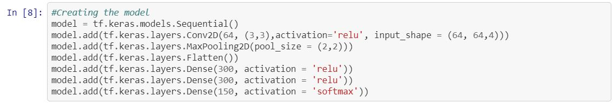
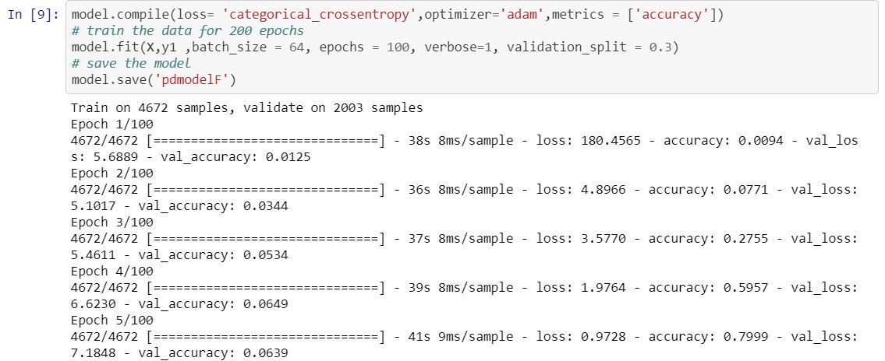
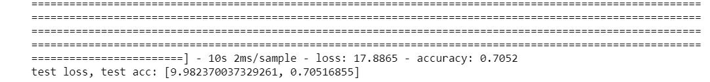
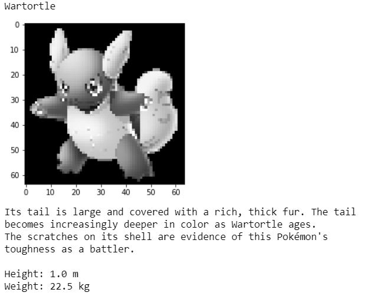
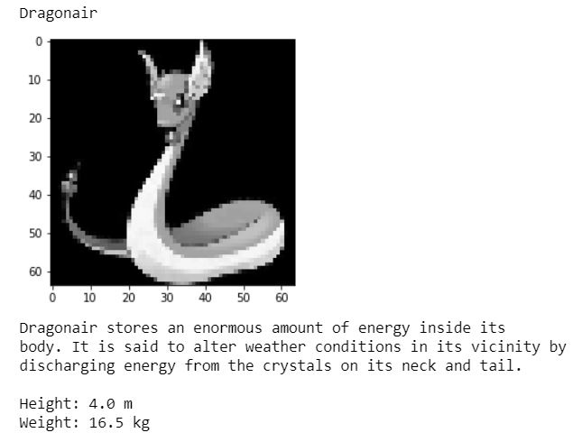

--- 
title: "Generation 1 Pokedex"
---
  
This was a personal project in which I attempted to replicate a Pokedex. Recently it was Pokémon day and Pokémon was a huge part of mine and a lot of people childhoods. So I thought it would be an interesting to create a Pokedex using coding.  

## What is a Pokedex?  
A Pokedex is an electronic encyclopaedia device which identify Pokémon seen and retrieve information related to identified Pokémon.
So, there are two components to the Pokedex which are: the identification of the Pokémon (image) and the information retrieval.
For identification I decided to use machine learning method called deep learning more specifically a convolutional neural network (CNN).
Deep learning is a specific approach used for building and training neural networks, which are considered highly promising decision-making nodes $[1]$ and a convolutional neural network (CNN) is a supervised learning method which has  an input layer, an output layer and various hidden layers. Some of these layers are convolutional, using a mathematical model to pass on results to successive layers $[2]$.
I decided to use this approach because it is the commonly used approach for image recognition and though it would be interesting to use and apply to this problem.
The second component is the retrieval of information. Obviously, I can't just go on a journey around the several regions to catch them all. So luckily there are other methods to retrieve information on Pokémon. The method used was one where a site which contained Pokémon information and certain items of information were retrieved using a web scraper (A web scraper just combs a website and extract information depending on what the user selects). The official Pokémon site was used as it is a reliable source of Pokémon information. In term of the information retrieved only the height and weight of each Pokémon was selected as an initial starting point. 

So, with the understanding of how the Pokedex is going to built. It’s time to build the Pokedex.

## Tools and environments    
* Python 3  
* Tensorflow 2    
* Keras  
* Numpy  
* OpenCV (cv2)    
* Matplotlib  
* OS    
* BeautifulSoup  

# Dataset  
The Dataset was retrieved from Kaggle [Dataset](https://www.kaggle.com/lantian773030/pokemonclassification). Only Generation 1 Pokémon were selected as an initial starting point with hopes to expand and cover all generations (1-6). For all of the Pokémon there was at least 10 images to allow the model to be trained.    

## Pre-processing  
  

## Building the model  
With model building there is not a one fit all for a problem, it may depend on the data that is being used on the model, what you are trying to accomplish with the model and there are other factors. From research and some trial and error this was the built model:
  

 

## Result of the model    
  
The accuracy of the model was 71%
The model accuracy is ok. But can the Pokedex correctly identify Pokémon?    

  
  

The model can identify Pokémon, but the model accuracy could be improved. This model can be applied professionally in a variety of way e.g. patient diagnostic using x ray images.  

# References  
[1] Techopedia.com. 2020. Deep Learning. [online] Available at: <https://www.techopedia.com/definition/30325/deep-learning> [Accessed 2 April 2020].    
[2] Techopedia.com. 2020.Convolutional Neural Network (CNN). [online] Available at: <https://www.techopedia.com/definition/32731/convolutional-neural-network-cnn> [Accessed 2 April 2020]

# Link to project    
<a href='https://github.com/bryanm17078/Keras-Gen1Pokedex/blob/master/PokedexFinal.ipynb'style="color:black;"><button class="btn default">Pokedex Notebook</button></a>

 
 
 
 
 
Copyright © Bryan Mensah

