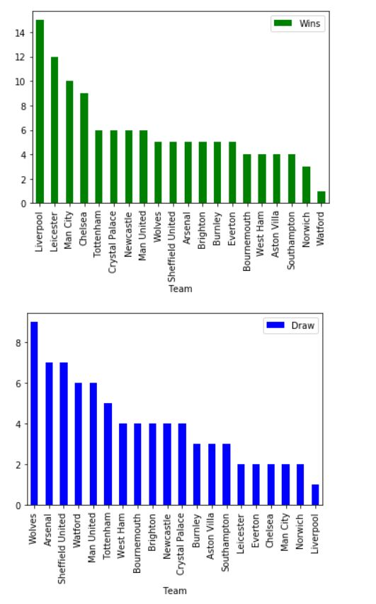
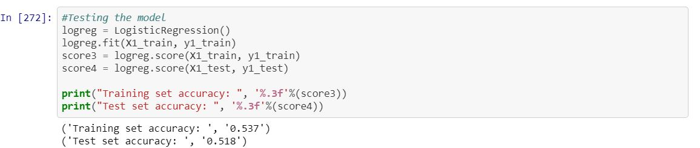
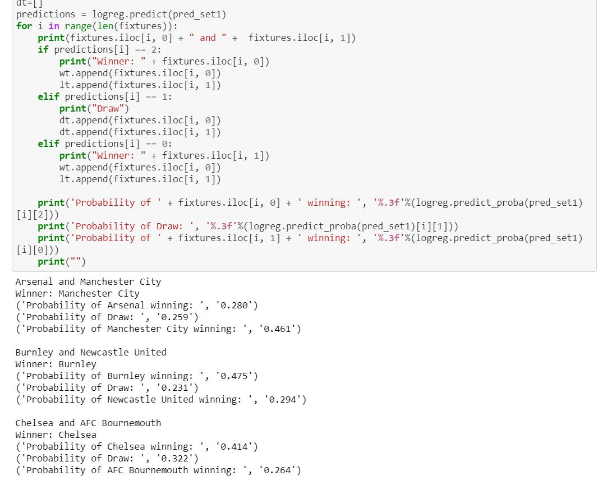
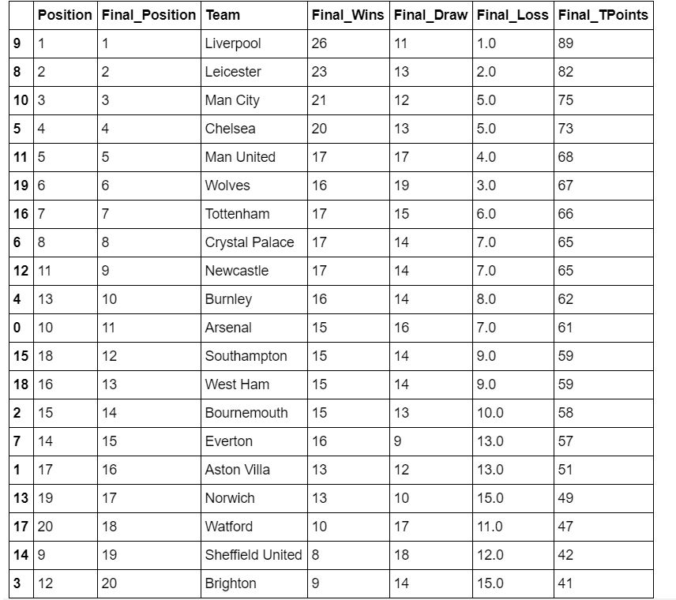

--- 
title: "Premier League 2019/20 Predicted"
---
 
This was a personal project in which I attempted to predict the result of the remaining premier league games and the final premier league table for the 2019/20 season.

The premier league is a 38 games competition where the best teams in England compete for the title, qualification to the top european competition (Champions League) and 2nd european competition (Europa League) and try to avoid relegation to a lower division. So, for most seasons for all teams every game count no matter where you are in the table and what you are trying to achieve. However, this season Liverpool are most certainly going to win the title and Manchester city seem to be set for 2nd. But there is some debate over who will get 3rd and 4th and who will go down. This is important as it has huge financial implications and can change a clubs' transfer planning. So I wanted to predict the final result and table to see where the team I support (Manchester United) would end up.  

# Tools and environment 

* Python 2.7  
* Jupyter Notebook  
* Numpy  
* Pandas    
* Matplotlib  
* Scikit-learn (LogisticRegression)

# Dataset
Datasets from football-data, Kaggle and soccersoda were selected for the premier league games that were played, the remaining fixtures and the historical premier league games dataset.
Taking care to remove games that where either team were not in the current premier league season from the historical dataset as I didn't want those result to add weight and potentially bias the model.  
   

# Building the model
A logistic regression over a linear regression was selected for the model. With logistic regression there are a finite number of outcomes that can be predicted whereas a linear regression has an infinite number of outcomes. In football there are only three possible outcome of a match: win, lose or draw. So, there isn't infinite outcomes for a match.
In addition to this it also had one of the higher accuracy when looking at model using similar analytical techniques.

# Results 
The model accuracy is 52%. Not the best accuracy but it can be improved. Let see how it does with the game and results prediction.
Image of the final table vs current table.   
  
   

From the table some key observations: 

* Liverpool win the title with 89 points  
* Leicester, Manchester City and Chelsea finished 2nd,3rd and 4th respectively and qualify for champions league   
* Manchester United and Wolves get 5th and 6th respectively and qualify for Europa league  
* Watford, Sheffield United, Brighton get relegated to the championship  

As mentioned before the model accuracy could be improved as there are a few result that are unlikely at this point in the season e.g. Sheffield United getting relegated. But there are obvious application in not only sport industry (betting) but also other industry e.g. in marketing it can be used to predict sales and help make informed decisions.

#  Link to project    
<a href='https://github.com/bryanm17078/Prem-Prediction-2019-20/blob/master/Prem%20Model%20Predicted.ipynb'style="color:black;"><button class="btn default">Premier league </button></a>

 
 
 
 
 
Copyright © Bryan Mensah

