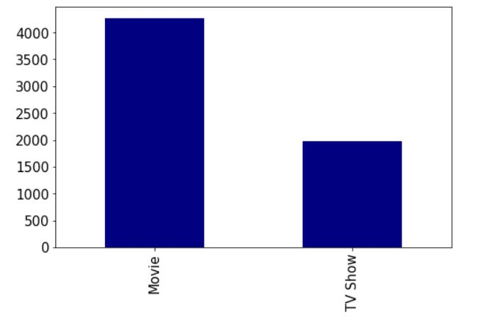
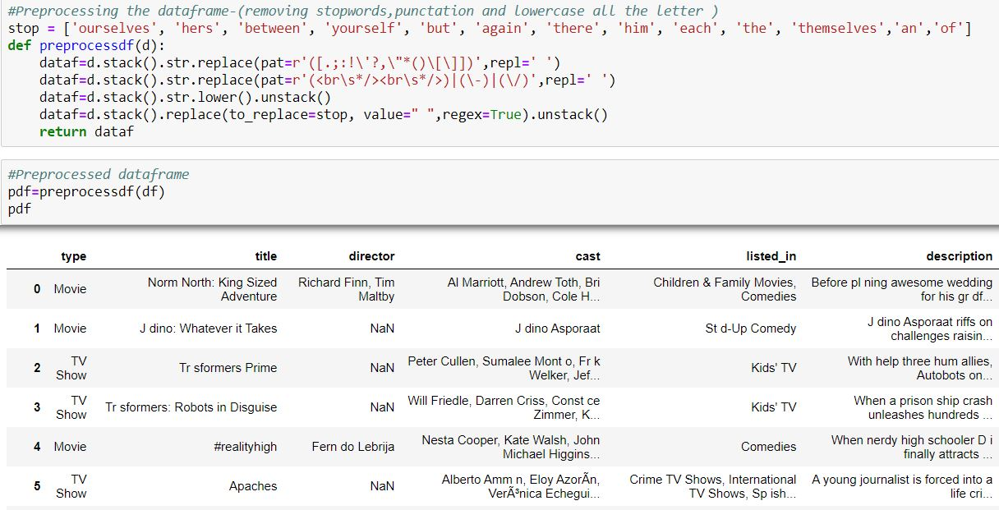
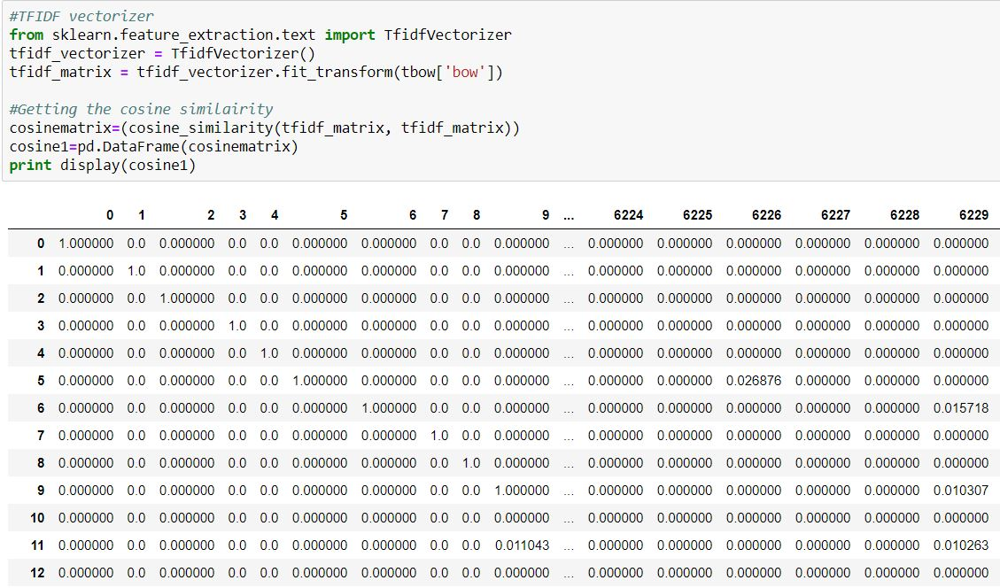

--- 
title: "Netflix Recommender System"
---

This a personal project in which I create a recommender to recommend show and movies to watch based on the similarity to the movies and tv shows I have selected.  
  
  

Unfortunately, the world in currently in the midst of  a global pandemic and here in the UK we are currently in a lockdown where we have to stay indoor unless necessary. During this time, I have made a positive out of a negative and I have furthered my skills, but I have also relaxed a bit. One way I have done so it by watching tv and movies. But personally, I find it hard to find and start new tv show and movie because there is so much to watch and I don’t want to spend all day searching for a new series or movie. So, with that in mind I decided to make the process easier with a recommender system.  

What is a recommender system?
Recommender system are software tools and techniques that provide recommendations or suggestion for items that they thinking the user will want or be useful to them $[1]$. 
There are various example of recommender systems that are used in the real world e.g. Amazon, YouTube, Spotify.
Recommender system mainly use two approaches: Collaborative and content-based filtering.
Collaborative based filtering uses a database about user preferences to predict additional topics or products a new user might like based on user with similar preferences to them $[2]$.
Content based filtering looks as the content of the item and recommend items which have similar contents.
I decided to go with content based over collaborative because the collaborative filtering assumes that the item which the user is interested wont change or vary which is unlikely as people grow and sometime have different interests. Where the content of the item won’t change over the time in my case with tv show and movies.
With the background we can begin the building of the recommender.  

# Tools and environments
* Python 2.7
* Jupyter Notebook
* Pandas
* NLTK  

# Dataset
Dataset retrieved from Kaggle is [here](https://www.kaggle.com/shivamb/netflix-shows) which contains information about tv show and movie from Netflix such as director, cast and description of the plot.  

 

# Exploratory Data analysis EDA
Performed some EDA on the data. Found that there were a lot more movies than TV Show which makes sense given their history and origins.  
  

# Preprocessing  
Pre-processing of the data include various techniques such as:  

* punctation removal
* Stop word removal
* Lower casing of all words in the dataset

  

# Raking  
Using the rake function from NLTK to extract key phrases from the plot description.

  

# TF-IDF and cosine similarity  
It is a statistic that reflect how important the word is to the document $[3]$. The cosine similarity which looked at how similar two words are and is one of the most common methods when looking at text data.

  

# Recommender

Here is some of the recommendation using some shows and movies that I have watched or am currently watching.
As you can see there are recommendation are pretty similar in content but there are some unusual recommendations. But I have viewed some of the recommendation and am pleased to say that I was able to pick up some new shows and movies that I wouldn’t have otherwise found. So, the recommender can recommend shows and movies, but it is a bit of hit and miss with some recommendation it may be due to certain factors e.g. not too many similar shows/movie in the dataset so I would have to make more additions to more show that I enjoy. But it is useful and can be applied other industries.  

    

   

   

    

# Possible improvements or additions

* Addition of more filtering option e.g. filter by country, duration of show/movie
* Increase the dataset by including other streaming service (Hulu, apple, Disney) data
* Calculating and displaying the probability that the user will like the recommended tv show and movies.  

# References

[1] Ricci, F., Rokach, L. and Shapira, B., 2010. Introduction To Recommender Systems Handbook. [online] Springer Link. Available at: <https://link.springer.com/chapter/10.1007/978-0-387-85820-3_1> [Accessed 2020].  
[2] Breese, J., Heckerman, D. and Kadie, C., 1998. Empirical Analysis Of Predictive Algorithms For Collaborative Filtering | Proceedings Of The Fourteenth Conference On Uncertainty In Artificial Intelligence. [online] Dl.acm.org. Available at: <https://dl.acm.org/doi/10.5555/2074094.2074100> [Accessed 1 May 2020].  
[3] Leskovec, J., Rajaraman, A., Labs, M. and Ullman, J.D. (2016). Mining of Massive Datasets. [online] Available at: http://infolab.stanford.edu/~ullman/mmds/book.pdf [Accessed 9 Jul. 2019].  

#  Link to project    
<a href='https://github.com/bryanm17078/NLP-Movie-Sentiment-Analysis/blob/master/NLP%20Movie%20Sentiment%20Analysis.ipynb'style="color:black;"><button class="btn default">Netflix TV Show/Movie Recommender</button></a>  

 
 
 
 
 
Copyright © Bryan Mensah

