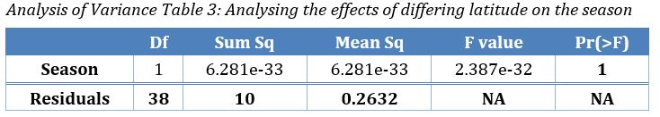

  
  

This was an academic work in which I analysed 3 datasets and answered question about the datasets.

Dataset 1: Marine microbial diversity
The dataset contained the microbial diversity of marine microbial organism that was sampled at 2 different seasons, at 2 different latitudes.
With dataset 1 the relationship if any was explored between the microbial diversity and latitude, time of year (season)

Dataset 2: Pairwise nucleotide substitutions and RNA expression levels
The dataset contained luciferase (P08659) and 30 homologous genes expression fold and their pairwise genetic distance from the genes sequence via a phylogenetic tree.
For dataset 2 the relationship between expression and genetic distance was explored (and possible reasons for this) along with some model validation.

Dataset 3: HIV viral load and within-patient population dynamics
The Dataset contain information about HIV load retrieved from patient sampled in a study. The sample taken from the spinal cord or brain with viral population size, pairwise genetic distance, Shannon population diversity and the CD4+ cell count.

For dataset 3 there was model selection to select the model which was most informative and then analysis of the selected model.

# Environment and techniques used  

* R
* ANOVA (Analysis of Variance)
* Scatter plot
* Interaction plot

# Result  

Some visualisation from the analysis    
  

# Link to the project  
For more detailed analysis,visualisation and dataset click the link.  
<a href='https://github.com/bryanm17078/R-Statistics'style="color:black;"><button class="btn default">R statistics</button></a>  

 
 
 
 
 
Copyright © Bryan Mensah

